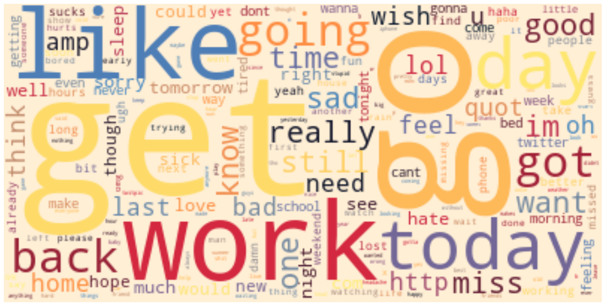

# Sentiment Analysis

## Text preprocessing and vocabulary building using `Texthero` 
* default texthero preprocessing used for cleaning a dataset. Finally, we got 359985 words for negative sentiments, and 442559 words for positive sentiments.
* vocabulary lengths for different term frequency thresholds are(words with higher than term frequency thresholds took into consideration while making vocabulary):
    * ft:0, vocabulary lenght:802544
    * ft:5, vocabulary lenght:51758 (this was chosen for TF-IDF vocabulary)
    * ft:25, vocabulary lenght:15658
    * ft:50, vocabulary lenght:9896
    * ft:100, vocabulary lenght:6138
* WordClouds using `Texthero` 

<table>
    <td>
        <center><b>Positive</b></center>
        
    </td>
    <td>
        <center><b>Negative</b></center>
        
    </td>
</table>


## TFIDF Representation

**TF-IDF Representation**: TF-IDF works by determining the relative frequency of words in a specific document compared to the inverse proportion of that word over the entire document corpus. It's used with a vocabulary size of `51758` to take only words with term frequency of higher than `25` in positive and negative samples.

```python
transformer=TfidfVectorizer(vocabulary=vocabs)
```


## Experimenting with Perceptron and Multi-layer Perceptron classifiers:


**Perceptron Classifier**: A basic Neural Network used for sentiment analysis.

**MLP Classifier**: A Multi-layer Perceptron classifier that uses log-loss function using LBFGS or stochastic gradient descent. [sklearn](https://scikit-learn.org/stable/modules/generated/sklearn.neural_network.MLPClassifier.html). MLP with a 2-hidden layer with 100 neurons on each layer respectively introduced, with a batch size of `512`. Due to a large number of samples in the dataset, and time complexity of training, I set `max_iter` to `20` epoch.

```python
MLPClassifier(hidden_layer_sizes=(100,100),batch_size=512, max_iter=20, verbose=True)
```

## Experimenting with an Naive Bayes, Logistic Regression, Linear SVM, and RandomForest Classifiers:
* **NB**: Naive Bayes, BernoulliNB implements the naive Bayes training and classification algorithms for data that is distributed according to multivariate Bernoulli distributions
* **LR**:Logistic Regression (aka logit, MaxEnt) classifier.
* **LSVM**:Linear Support Vector Classification.
* **RF**  : A random forest is a meta estimator that fits a number of decision tree classifiers on various sub-samples of the dataset and uses averaging to improve the predictive accuracy and control over-fitting.


## Experimenting with an Fully Connected Neural Network (FCNN) Classifier:
* input layer consist of 512 neurons, with activation function of ReLU and droup out with probability of 40%
* 3-hidden layer deep neural network, with activation functions of ReLU, and layers with 256 neurons on each.
* output layer consist of 2 neurons, with activation function of sigmoid
* train have done in 3 iterations ( 30 minutes each iteration) 
* I achieved much more reliable result with FCNN
* what else we can do? 


## Obtained Results for Models

|Model Description|Precission|Recall|F1-Score| Accuracy|
|-----------------|----------|------|--------|---------|
| TFIDF+Perceptron| 0.71     | 0.71 | 0.71   | 0.71    |
| TFIDF+MLP       | 0.75     | 0.75 | 0.75   | 0.75    |
| TFIDF+NB        | 0.77     | 0.77 | 0.77   | 0.77    |
| TFIDF+LR        | 0.78     | 0.78 | 0.78   | 0.78    |
| TFIDF+LSVM      | 0.78     | 0.78 | 0.78   | 0.78    |
| TFIDF+RF        | 0.75     | 0.75 | 0.75   | 0.75    |
| TFIDF+FCNN      | 0.79     | 0.79 | 0.79   | 0.79    |


## Requirements
* keras
* tensorflow
* scikit-learn
* texthero
* nltk
* numpy
* tweet-preprocessor